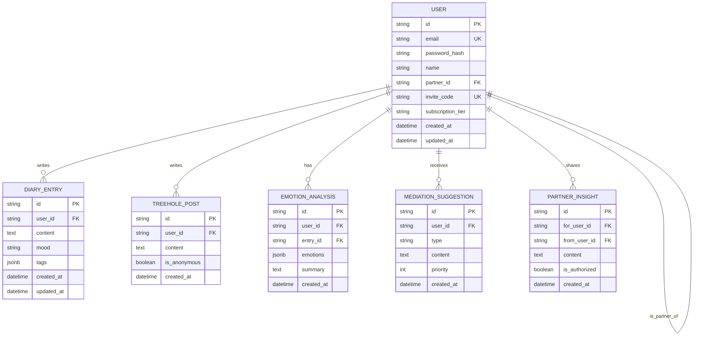

## 1. Architecture Design

```mermaid
graph TB
    subgraph Frontend
        A[React + TypeScript]
        B[React Router]
        C[Tailwind CSS]
        D[Zustand]
        E[Recharts]
    end
    
    subgraph Backend
        F[Express.js]
        G[AI Service]
        H[Emotion Analysis]
        I[Mediation Engine]
    end
    
    subgraph Database
        J[(PostgreSQL)]
        K[User Profiles]
        L[Diary Entries]
        M[Treehole Posts]
        N[Relationship Data]
    end
    
    subgraph External
        O[LLM API]
        P[Auth Service]
    end
    
    A --&gt; F
    F --&gt; J
    F --&gt; O
    F --&gt; P
    G --&gt; H
    G --&gt; I
    J --&gt; K
    J --&gt; L
    J --&gt; M
    J --&gt; N
```

## 2. Technology Description
- **Frontend**: React@18 + TypeScript + Tailwind CSS@3 + Vite + Zustand + Recharts
- **Initialization Tool**: vite-init
- **Backend**: Express.js@4 + TypeScript
- **Database**: PostgreSQL (可选择Supabase或自建)
- **AI/LLM**: OpenAI API / 国内大模型API

## 3. Route Definitions
| Route | Purpose |
|-------|---------|
| / | 重定向到 /dashboard |
| /login | 登录页面 |
| /register | 注册页面 |
| /dashboard | 首页/仪表盘 |
| /diary | 日记列表 |
| /diary/new | 新建日记 |
| /diary/:id | 日记详情 |
| /treehole | 树洞页面 |
| /mediation | AI调解页面 |
| /settings | 设置页面 |

## 4. API Definitions

### Type Definitions
```typescript
// 用户相关
interface User {
  id: string;
  email: string;
  phone?: string;
  name: string;
  partnerId?: string;
  inviteCode?: string;
  subscriptionTier: 'free' | 'premium' | 'family';
  createdAt: string;
}

interface AuthCredentials {
  email: string;
  password: string;
}

interface AuthResponse {
  user: User;
  token: string;
}

// 日记相关
interface DiaryEntry {
  id: string;
  userId: string;
  content: string;
  mood: 'happy' | 'neutral' | 'sad' | 'angry' | 'anxious';
  tags: string[];
  createdAt: string;
  updatedAt: string;
}

interface CreateDiaryRequest {
  content: string;
  mood: string;
  tags?: string[];
}

// 树洞相关
interface TreeholePost {
  id: string;
  userId: string;
  content: string;
  isAnonymous: boolean;
  createdAt: string;
}

// AI分析相关
interface EmotionAnalysis {
  id: string;
  userId: string;
  entryId: string;
  emotions: {
    anger: number;
    sadness: number;
    anxiety: number;
    joy: number;
  };
  summary: string;
  createdAt: string;
}

interface MediationSuggestion {
  id: string;
  userId: string;
  type: 'communication' | 'reflection' | 'exercise';
  content: string;
  priority: number;
  createdAt: string;
}

interface PartnerInsight {
  id: string;
  forUserId: string;
  fromUserId: string;
  content: string;
  isAuthorized: boolean;
  createdAt: string;
}

// 仪表盘数据
interface DashboardData {
  relationshipHealth: number;
  emotionTrend: Array&lt;{ date: string; score: number }&gt;;
  positiveRatio: number;
  recentSuggestions: MediationSuggestion[];
}
```

### API Endpoints
```
POST   /api/auth/register
POST   /api/auth/login
POST   /api/auth/logout
GET    /api/auth/me

POST   /api/partnership/invite
POST   /api/partnership/accept
DELETE /api/partnership

GET    /api/diary
POST   /api/diary
GET    /api/diary/:id
PUT    /api/diary/:id
DELETE /api/diary/:id

GET    /api/treehole
POST   /api/treehole
DELETE /api/treehole/:id

GET    /api/analysis/emotions/:entryId
GET    /api/analysis/suggestions
GET    /api/analysis/insights
POST   /api/analysis/insights/:id/authorize

GET    /api/dashboard

GET    /api/user/profile
PUT    /api/user/profile
PUT    /api/user/subscription
DELETE /api/user/account
```

## 5. Server Architecture Diagram

```mermaid
graph LR
    subgraph Controllers
        A[AuthController]
        B[DiaryController]
        C[TreeholeController]
        D[AnalysisController]
        E[PartnershipController]
    end
    
    subgraph Services
        F[AuthService]
        G[DiaryService]
        H[TreeholeService]
        I[AIService]
        J[PartnershipService]
    end
    
    subgraph Repositories
        K[UserRepository]
        L[DiaryRepository]
        M[TreeholeRepository]
        N[AnalysisRepository]
    end
    
    A --&gt; F
    B --&gt; G
    C --&gt; H
    D --&gt; I
    E --&gt; J
    
    F --&gt; K
    G --&gt; L
    H --&gt; M
    I --&gt; N
    J --&gt; K
    
    K --&gt; O[(Database)]
    L --&gt; O
    M --&gt; O
    N --&gt; O
    
    I --&gt; P[LLM API]
```

## 6. Data Model

### 6.1 Data Model Definition


### 6.2 Data Definition Language
```sql
-- 用户表
CREATE TABLE users (
    id UUID PRIMARY KEY DEFAULT gen_random_uuid(),
    email VARCHAR(255) UNIQUE NOT NULL,
    password_hash VARCHAR(255) NOT NULL,
    name VARCHAR(100) NOT NULL,
    partner_id UUID REFERENCES users(id),
    invite_code VARCHAR(20) UNIQUE,
    subscription_tier VARCHAR(20) DEFAULT 'free',
    created_at TIMESTAMP WITH TIME ZONE DEFAULT CURRENT_TIMESTAMP,
    updated_at TIMESTAMP WITH TIME ZONE DEFAULT CURRENT_TIMESTAMP
);

-- 日记表
CREATE TABLE diary_entries (
    id UUID PRIMARY KEY DEFAULT gen_random_uuid(),
    user_id UUID REFERENCES users(id) NOT NULL,
    content TEXT NOT NULL,
    mood VARCHAR(20) NOT NULL,
    tags JSONB DEFAULT '[]',
    created_at TIMESTAMP WITH TIME ZONE DEFAULT CURRENT_TIMESTAMP,
    updated_at TIMESTAMP WITH TIME ZONE DEFAULT CURRENT_TIMESTAMP
);

-- 树洞表
CREATE TABLE treehole_posts (
    id UUID PRIMARY KEY DEFAULT gen_random_uuid(),
    user_id UUID REFERENCES users(id) NOT NULL,
    content TEXT NOT NULL,
    is_anonymous BOOLEAN DEFAULT true,
    created_at TIMESTAMP WITH TIME ZONE DEFAULT CURRENT_TIMESTAMP
);

-- 情绪分析表
CREATE TABLE emotion_analyses (
    id UUID PRIMARY KEY DEFAULT gen_random_uuid(),
    user_id UUID REFERENCES users(id) NOT NULL,
    entry_id UUID REFERENCES diary_entries(id) NOT NULL,
    emotions JSONB NOT NULL,
    summary TEXT,
    created_at TIMESTAMP WITH TIME ZONE DEFAULT CURRENT_TIMESTAMP
);

-- 调解建议表
CREATE TABLE mediation_suggestions (
    id UUID PRIMARY KEY DEFAULT gen_random_uuid(),
    user_id UUID REFERENCES users(id) NOT NULL,
    type VARCHAR(50) NOT NULL,
    content TEXT NOT NULL,
    priority INTEGER DEFAULT 1,
    created_at TIMESTAMP WITH TIME ZONE DEFAULT CURRENT_TIMESTAMP
);

-- 伴侣心声表
CREATE TABLE partner_insights (
    id UUID PRIMARY KEY DEFAULT gen_random_uuid(),
    for_user_id UUID REFERENCES users(id) NOT NULL,
    from_user_id UUID REFERENCES users(id) NOT NULL,
    content TEXT NOT NULL,
    is_authorized BOOLEAN DEFAULT false,
    created_at TIMESTAMP WITH TIME ZONE DEFAULT CURRENT_TIMESTAMP
);

-- 索引
CREATE INDEX idx_diary_user ON diary_entries(user_id);
CREATE INDEX idx_treehole_user ON treehole_posts(user_id);
CREATE INDEX idx_analysis_user ON emotion_analyses(user_id);
CREATE INDEX idx_suggestions_user ON mediation_suggestions(user_id);
CREATE INDEX idx_insights_for ON partner_insights(for_user_id);
CREATE INDEX idx_insights_from ON partner_insights(from_user_id);

-- 初始数据
INSERT INTO users (email, password_hash, name, invite_code, subscription_tier) VALUES
('demo1@example.com', '$2b$10$...', '张三', 'ABC123', 'premium'),
('demo2@example.com', '$2b$10$...', '李四', 'DEF456', 'premium');
```
