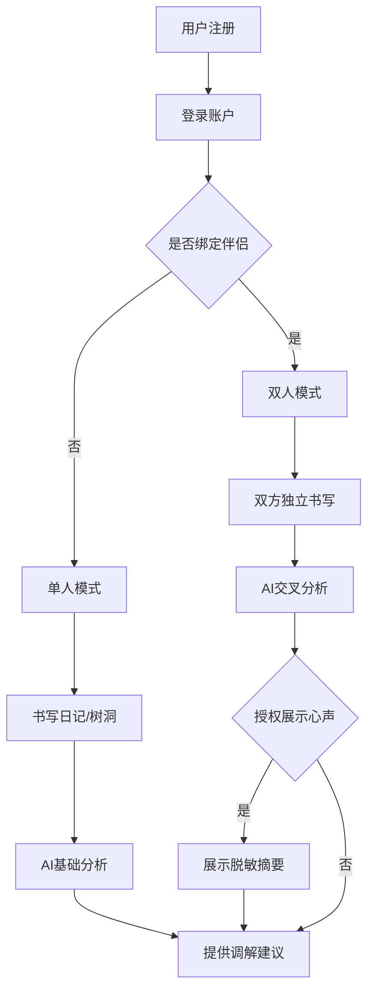

## 1. Product Overview
EchoHollow（回声树洞）是一款专为已婚/稳定伴侣设计的AI情感调解APP。夫妻双方绑定账户后，可各自书写日记、记录笔记、通过树洞宣泄情绪，AI智能分析双方情感状态并提供关系调节建议，帮助改善沟通、预防冲突升级。目标是成为"口袋里的婚姻顾问"，满足中国高离婚率背景下夫妻对便捷、私密、低成本关系修复工具的强烈需求。

## 2. Core Features

### 2.1 User Roles
| Role | Registration Method | Core Permissions |
|------|---------------------|------------------|
| 普通用户 | 手机号/邮箱注册 | 个人日记、树洞、查看仪表盘 |
| 绑定用户 | 邀请码绑定 | 双人空间、AI调解建议、关系报告 |

### 2.2 Feature Module
1. **登录/注册页**: 用户认证、邀请码绑定
2. **首页/仪表盘**: 关系健康状态、情绪趋势可视化
3. **日记页**: 个人日记书写、情绪标记、历史记录
4. **树洞页**: 情绪宣泄、语音输入、私密记录
5. **AI调解页**: 个性化建议、沟通引导、心声摘要
6. **设置页**: 账户管理、隐私设置、订阅管理

### 2.3 Page Details
| Page Name | Module Name | Feature description |
|-----------|-------------|---------------------|
| 登录/注册页 | 用户认证 | 手机号/邮箱注册、登录、密码重置 |
| 登录/注册页 | 邀请绑定 | 生成邀请码、输入邀请码绑定伴侣 |
| 首页/仪表盘 | 健康状态展示 | 关系温度计、情绪趋势图、积极/消极比例 |
| 首页/仪表盘 | 快捷入口 | 快速进入日记、树洞、AI调解 |
| 日记页 | 日记编辑 | 文字输入、心情标签、保存草稿 |
| 日记页 | 日记列表 | 时间线展示、情绪筛选、搜索功能 |
| 树洞页 | 情绪宣泄 | 无保留书写、语音输入、匿名化处理 |
| 树洞页 | 历史记录 | 私密存储、可删除、导出 |
| AI调解页 | 分析报告 | 情绪分析、冲突模式识别、危险信号预警 |
| AI调解页 | 调解建议 | 个性化策略、NVC对话引导、情感练习 |
| AI调解页 | 心声摘要 | 授权后展示AI转述的对方心声 |
| 设置页 | 账户管理 | 个人信息、修改密码、退出登录 |
| 设置页 | 隐私设置 | 数据加密、删除账户、导出数据 |
| 设置页 | 订阅管理 | 套餐选择、支付、取消订阅 |

## 3. Core Process
用户注册登录后，可选择是否绑定伴侣。单人模式下可使用日记、树洞和基础AI分析。绑定伴侣后进入双人模式，双方可独立使用所有功能，AI在保护隐私的前提下分析双方数据并提供调解建议。当一方授权时，可向对方展示脱敏后的心声摘要，促进沟通。

## 4. User Interface Design
### 4.1 Design Style
- **主色调**: 温暖的珊瑚红(#FF6B6B) + 柔和的薄荷绿(#4ECDC4) + 深邃的午夜蓝(#2C3E50)
- **辅助色**: 米白色背景(#FAFAFA)、浅灰色文字(#7F8C8D)
- **按钮风格**: 圆角矩形、柔和阴影、渐变填充
- **字体**: 标题使用Noto Serif SC（优雅），正文使用Noto Sans SC（易读）
- **布局风格**: 卡片式布局、充足留白、柔和圆角
- **图标风格**: 线性图标、暖色调、简洁温馨

### 4.2 Page Design Overview
| Page Name | Module Name | UI Elements |
|-----------|-------------|-------------|
| 首页/仪表盘 | 健康状态展示 | 渐变圆形温度计、折线图、数据卡片网格 |
| 日记页 | 日记编辑 | 温暖的编辑器背景、心情表情选择器、浮动保存按钮 |
| 树洞页 | 情绪宣泄 | 深色模式可选、语音输入动画、确认提交弹窗 |
| AI调解页 | 分析报告 | 渐变色情绪雷达图、建议卡片、温和动画效果 |

### 4.3 Responsiveness
- Desktop-first设计，适配移动端
- 响应式断点：1200px、768px、480px
- 触控优化：大点击区域、手势支持
- 深色/浅色主题切换

### 4.4 3D Scene Guidance
本产品暂不包含3D场景。
